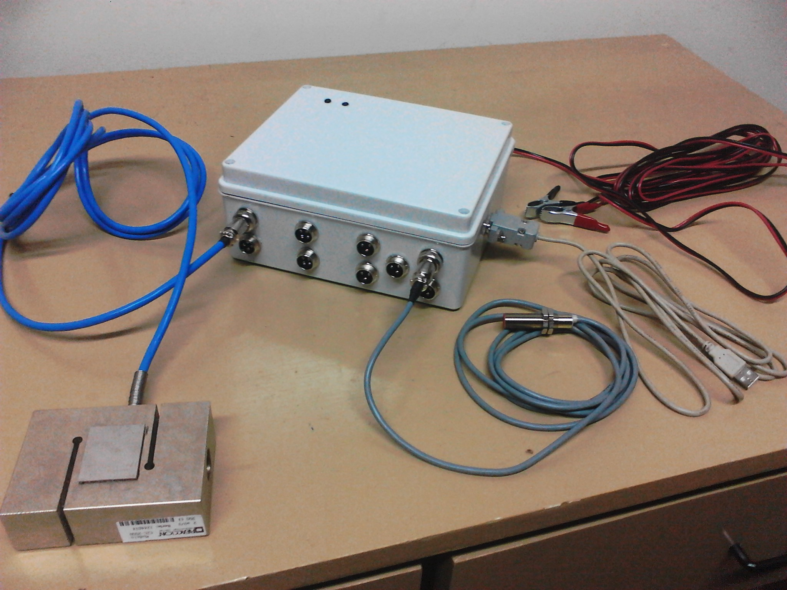

# Registrador dinamométrico para maquinarias agropecuarias

Dispositivo para el registro de datos de cuatro canales para celdas de cargas y cinco canales para contadores de pulso. El registrador se aplica para la medición de esfuerzos de tracción y velocidades de rotación de ejes o ruedas de maquinaria agrícola.

Está diseñado para alimentarse con batería de 12V, tolerancia para conexión invertida y con caída de tensión de hasta 10V. Posee reloj interno con vida útil de más de 5 años, almacenamiento de datos de hasta 4GB y conexión USB para la descarga de datos.

Se incluye el software para la configuración del registrador:
   - Listado de registros almacenados.  
   - Descarga de registros.  
   - Eliminación de registros.  
   - Lectura de celdas de carga.  
   - Configuración de fecha y hora.  

## Esquema de bloques genérico

## Placa mother

## Circuito de celdas de carga

## Circuito de contadores de pulso

## Versión actualizada

La nueva versión incluye un display de 20x4 para mostrar estado de las entradas en el caso de requerir mediciones no periódicas. Cuando el switch de activación se enciende, el display indica que el registrador se encuentra en modo de medición y registro de datos.  

